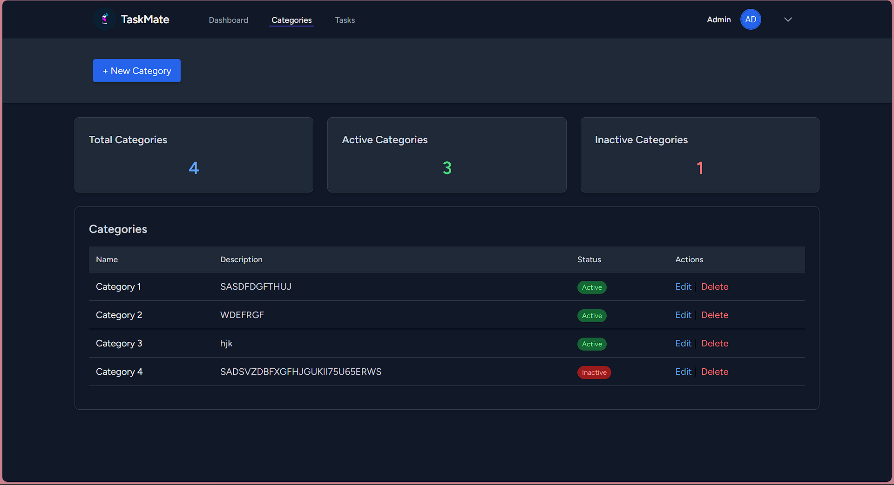

# Software Engineering Internship Assignment
# TaskMate - Task Management System

This web application allows users to efficiently manage their tasks, categorize them, and track progress through an intuitive dashboard.  
Developed as part of an internship  project.

---


##  Features

- 🔐 **User Authentication** – Login, Register, Logout (via Laravel Breeze)
- 👥 **User Roles** – Admin and User
- 🗂️ **Task Management (CRUD)** – Create, view, update, and delete tasks
- 🏷️ **Category Management** – Manage categories and assign them to tasks
- 📅 **Task Deadlines & Status Tracking**
- 📊 **Dashboard Overview** – with progress counts & summaries
- 🖨️ **PDF Report Generation**
- 💻 **Responsive UI** – Built with Tailwind CSS (light & dark mode)
- 🧱 **Clean MVC Laravel Architecture**

---

##  Tech Stack

| Layer | Technology |
|-------|-------------|
| Framework | **Laravel 11** |
| Frontend | **Blade Templates + Tailwind CSS** |
| Database | **MySQL** |
| Authentication | **Laravel Breeze / TaskMate** |
| PDF Generation | **barryvdh/laravel-dompdf** |
| Version Control | **Git & GitHub** |

---

##  Installation Guide

Follow these steps to set up and run the project locally 👇


### 1️⃣ Clone the Repository
```bash
git clone https://github.com/Aathi125/Task-Management-Web-Application/tree/main
```

### 2️⃣ Install Dependencies
```bash
composer install
npm install
npm run dev
```

### 3️⃣ Create Environment File
- cp .env.example .env
### 4️⃣ Configure Database
```
Open the .env file and update your database credentials:

DB_DATABASE=task__management
DB_USERNAME=root
DB_PASSWORD=
```
### 5️⃣ Generate Application Key
```
php artisan key:generate
```

### 6️⃣ Run Migrations and Seeders
```
php artisan migrate --seed
```

###7️⃣ Start the Development Server
```
php artisan serve
```
---
#### Now open your browser and visit 👉 http://localhost:8000
---
### 🧩 Folder Structure
```bash
app/
 ├── Http/
 │    └── Controllers/
 │         ├── TaskController.php
 │         └── CategoryController.php
 ├── Models/
 │    ├── Task.php
 │    └── Category.php
resources/
 ├── views/
 │    ├── tasks/
 │    ├── categories/
 │    └── layouts/
routes/
 └── web.php
```
---
### 👑 Default Admin Credentials (if seeded)
``` bash
Email: admin@example.com
Password: password
```
### 💻 How It Works

- Admin Login
- Can manage both tasks and categories.
- Assign tasks to users and set deadlines.
- View progress statistics on the dashboard.
- User Login
- Can view only their assigned tasks.
- Update task statuses as they progress.
- Monitor pending and completed tasks.
- Dark Mode Support
- Automatically switches between light and dark themes based on system settings.
---

### 🧠 Project Overview

TaskMate was built using a modern Laravel stack with Tailwind CSS and follows a clean MVC structure.
It demonstrates practical implementation of:

- CRUD operations
- Middleware-based authentication
- Role-based access control (admin/user)
- Dynamic data binding using Blade
- Clean UI built for performance and accessibility
---

### 👨‍💻 Developer Information

Developed by: Aathika Ilmudeen
- 🎓 BSc (Hons) in Information Technology – Sri Lanka Institute of Information Technology (SLIIT)
- 💼 Intern – Software Engineer
- 🌐 Project: TaskMate – Laravel Task Management System
- 💡 Passionate about: Laravel, TailwindCSS, and scalable web solutions.
